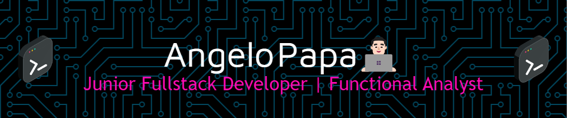

---
<h3 align="center">👋 Ciao</h3>

Sono Angelo Papa e sono un ragazzo con una grande passione per la programmazione e la tecnologia. 

Ho frequentato l'ITS Apulia Digital Maker dove ho avuto modo di studiare e utilizzare differenti linguaggi/framework e tecnologie di programmazione, sono aperto a nuove sfide che mi consentano di iniziare la mia carriera nel settore.

---

💼 **Esperienza Professionale:**
- Attualmente lavoro come Cloud Infrastructure Analyst presso iCubed S.R.L. | Melfi (PZ).
- Stage come Software Developer presso Fincons Group | Bari (BA).
  

🎓 **Istruzione e Formazione:**
- Corso di *Functional Analyst* presso Deloitte NextHub Academy | Bari (BA).
- Corso da sviluppatore software presso ITS APULIA DIGITAL MAKER | Bari (BA).
- Diploma Istituto Tecnico e Professionale presso I.I.S. "TEN. R. RIGHETTI" | Melfi (PZ).

📫 **Contattami:**

---

🙋🏻 **Altro su di me:**

📺 🎮 Mi piace guardare anime e giocare ai videogiochi

⚽ 🏋️ Amo giocare a calcio e andare in palestra 

📚 🎵 Mi piace leggere e ascoltare musica hip hop/country
<!--
**angelopapa/angelopapa** is a ✨ _special_ ✨ repository because its `README.md` (this file) appears on your GitHub profile.

Here are some ideas to get you started:

- 🔭 I’m currently working on ...
- 🌱 I’m currently learning ...
- 👯 I’m looking to collaborate on ...
- 🤔 I’m looking for help with ...
- 💬 Ask me about ...
- 📫 How to reach me: ...
- 😄 Pronouns: ...
- ⚡ Fun fact: ...
-->
